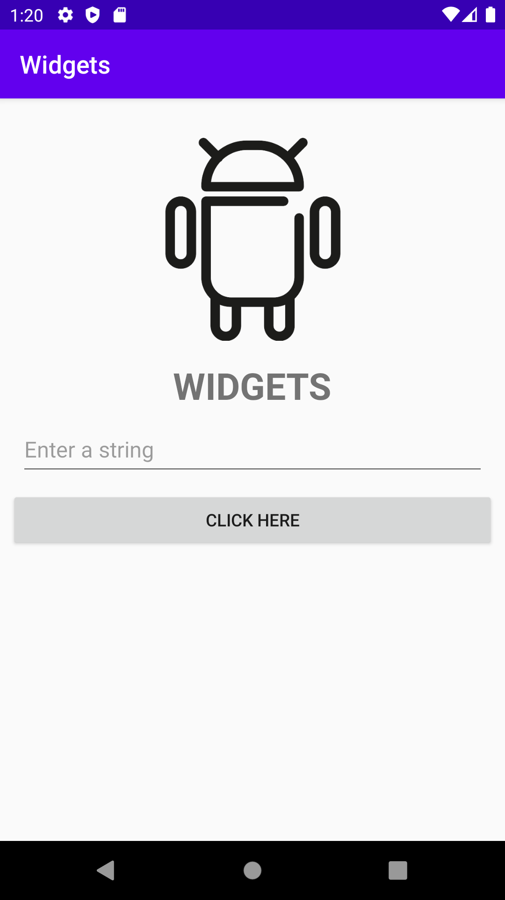

# Rapport

I `activity_main.xml` implementerades tre olika widgets utöver den textview som redan fanns. Dessa widgets är `EditText`, en `Imageview` och `Button`. En `onClick` metod används med knappen för att gömma eller visa den `ImageView` som nämnts när användaren trycker på knappen. 

För att skapa en strukturerad layout så används `ConstraintLayout` som bestämmer hur dessa widgets ska placeras i applikationens användargränssnitt. Den ordning som widgets ska visas i applikationen bestäms genom constraints. Ett exempel för detta visas i kodstycket nedan. I kodstycket så används `layout_constraint` nyckelordet för att bestämma hur just denna widget ska ligga relativt till skärmen och andra widgets.

```xml
    <EditText
        android:id="@+id/editTextView"
        android:layout_width="0dp"
        android:minHeight="48dp"
        android:layout_height="wrap_content"
        android:layout_marginStart="16dp"
        android:layout_marginLeft="16dp"
        android:layout_marginTop="8dp"
        android:layout_marginEnd="16dp"
        android:layout_marginRight="16dp"
        android:hint="@string/editview_text"
        android:lineSpacingExtra="4sp"
        android:textAppearance="@style/TextAppearance.AppCompat.Display3"
        android:textSize="18sp"
        app:layout_constraintEnd_toEndOf="parent"
        app:layout_constraintStart_toStartOf="parent"
        app:layout_constraintTop_toBottomOf="@id/headerView" />
```

Dessa constraints bestämdes genom att redigera `activity_main.xml` filen, och positioneringen av widgets ändrades genom att nyttja design-läget.
För att bestämma storleken för en widget så används framförallt `wrap_content` och `0dp` för höjden och bredden. Det senare används för att låta en widget ta upp all tillgänglig yta på antingen höjden eller bredden. Detta visas i exemplet nedan. I exemplet visas även `margin` som används för att varje widget i applikationen ska tillåtas lite utrymme mellan skärmens kant eller andra widgets.

```xml
    <Button
        android:id="@+id/buttonView"
        android:layout_width="0dp"
        android:layout_height="wrap_content"
        android:layout_marginStart="8dp"
        android:layout_marginLeft="8dp"
        android:layout_marginTop="8dp"
        android:layout_marginEnd="8dp"
        android:layout_marginRight="8dp"
        android:layout_marginBottom="8dp"        
        .
        .
        .
    />
```

Imageview:en visar en bild och för att bestämma storleken för denna så används absoluta värden, eftersom att bilden inte behöver vara särskilt stor (se kodstycket nedan).

```xml
    <ImageView
        android:id="@+id/imageView"
        android:layout_width="232dp"
        android:layout_height="165dp"
        .
        .
        .
    />
```


Nedan visas en bild på applikationen och den layout som beskrivits.



